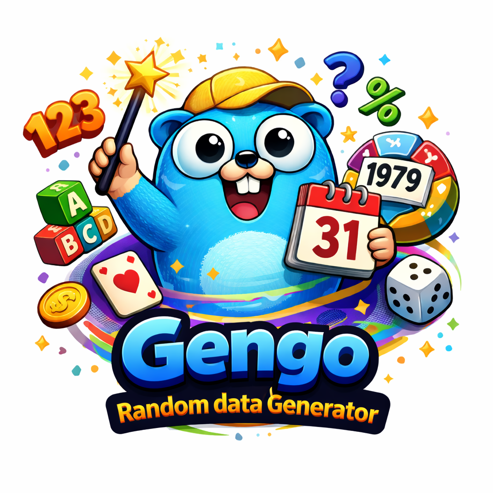

<p align="center">
  
</p>

# gengo — Random Data Generator for Go

[](https://github.com/FlavioCFOliveira/gengo/actions/workflows/go.yml)
[](https://pkg.go.dev/github.com/FlavioCFOliveira/gengo)
[](https://goreportcard.com/report/github.com/FlavioCFOliveira/gengo)
[](https://go.dev/doc/devel/release)
[](LICENSE)
[](https://github.com/FlavioCFOliveira/gengo/releases)

**gengo** is a zero-dependency Go library for generating random test data — strings, numbers, dates, booleans, and words — with a single function call. No configuration, no boilerplate. Just fast, reliable random data whenever you need it.

## Why gengo?

Generating realistic test data in Go usually means writing repetitive helper functions or pulling in heavy dependencies. gengo solves this with a clean, idiomatic API that covers the most common use cases out of the box:

- **One function call** to generate any random value
- **Zero external dependencies** — only the Go standard library
- **Blazing fast** — sub-5ns for most operations on modern hardware
- **Safe by default** — built-in overflow protection, size limits, and uniform distribution

## Installation

```bash
go get -u github.com/FlavioCFOliveira/gengo
```

Requires Go 1.26 or later.

---

## Quick Start

```go
package main

import (
    "fmt"
    "github.com/FlavioCFOliveira/gengo"
)

func main() {
    // Random alphanumeric string — great for tokens and IDs
    fmt.Println(gengo.StringAlphanumeric(20))
    // Output: k9mP2vLxQr5tWnB8aJc

    // Random integer in a custom range
    fmt.Println(gengo.IntBetween(1, 100))
    // Output: 42

    // Random date anywhere in history or the future
    fmt.Println(gengo.Date())
    // Output: 1847-03-15 08:23:17 UTC
}
```

---

## Table of Contents

- [String Generation](#string-generation)
- [Number Generation](#number-generation)
  - [Integers](#integers)
  - [Floating Point](#floating-point)
  - [Complex Numbers](#complex-numbers)
- [Date & Time](#date--time)
- [Booleans](#booleans)
- [Words & Text](#words--text)
- [Character Sets](#character-sets)
- [Safety & Limits](#safety--limits)
- [Performance](#performance)

---

## String Generation

All string functions accept a `length` parameter (capped at 1 MB). Pick a predefined type or pass your own character set.

### Custom and Variable-Length Strings

```go
// Generate from a custom character set
custom := gengo.String(10, "ABC123")
// Output: C1BA3C2A1B

// Generate a string with a random length between min and max
variable := gengo.StringBetween(5, 15, gengo.Alphanumeric)
```

### Predefined String Types

| Function | Output characters | Example |
|----------|-------------------|---------|
| `StringAllChars(n)` | Letters + numbers + symbols | `aB3$kP9@mQ` |
| `StringAlphanumeric(n)` | Letters + numbers | `xK8pM2vLqR` |
| `StringAlphabetic(n)` | Upper and lower case letters | `bGtRvNmKlP` |
| `StringAlphabeticUppercase(n)` | A–Z only | `XKMTPQRLVN` |
| `StringAlphabeticLowercase(n)` | a–z only | `mkptqrvbgs` |
| `StringNumeric(n)` | Digits 0–9 only | `8472936105` |
| `StringHexadecimal(n)` | Hex digits 0–9, A–F | `A7F3B9E2D1` |
| `StringSymbols(n)` | Special characters only | `@#$%&*()-_` |

### Generating a Secure Password

A secure password needs at least 12 characters and a mix of uppercase letters, lowercase letters, digits, and symbols. `StringAllChars` covers all four groups in one call:

```go
// 16-character password with letters, numbers, and symbols
password := gengo.StringAllChars(16)
// Output: k9@mP2#vLx$Qr5tW

// Longer passphrase-style password (24 chars) for higher-security contexts
strongPassword := gengo.StringAllChars(24)
// Output: T7$mKp2#vLx@Qr5tWnB8aJc!

// Alphanumeric-only password (no symbols) — useful when the target system
// restricts special characters
safePassword := gengo.StringAlphanumeric(16)
// Output: xK8pM2vLqRtWnB5a
```

> `StringAllChars` draws from 94 characters (a–z, A–Z, 0–9, and 32 symbols),
> giving each 16-character password over 10²⁹ possible combinations.

**Common use cases:**

```go
// API token or session ID
token := gengo.StringHexadecimal(32)
// Output: A7F3B9E2D108C4E5A67F9B2C1D0E8F5A

// Short readable identifier
id := gengo.StringAlphanumeric(8)
// Output: xK8pM2vL
```

---

## Number Generation

### Integers

Every integer type comes in two flavours:
- `Type()` — full range of that type
- `TypeBetween(min, max)` — your custom range (min and max are swapped automatically if reversed)

| Type | Function | Full Range | Range example |
|------|----------|------------|---------------|
| `int8` | `Int8()` | −128 to 127 | `Int8Between(-50, 50)` |
| `int16` | `Int16()` | −32 768 to 32 767 | `Int16Between(100, 1000)` |
| `int32` | `Int32()` | ±2 billion | `Int32Between(0, 999999)` |
| `int64` | `Int64()` | ±9 quintillion | `Int64Between(0, time.Now().Unix())` |
| `int` | `Int()` | Platform dependent | `IntBetween(1, 100)` |
| `uint8` / `byte` | `UInt8()` / `Byte()` | 0 to 255 | `UInt8Between(0, 255)` |
| `uint16` | `UInt16()` | 0 to 65 535 | `UInt16Between(1000, 5000)` |
| `uint32` | `UInt32()` | 0 to 4 billion | `UInt32Between(0, 100000)` |
| `uint64` | `UInt64()` | 0 to 18 quintillion | `UInt64Between(0, math.MaxUint32)` |

```go
// Random age between 18 and 100
age := gengo.IntBetween(18, 100)

// Random percentage (0–100)
percent := gengo.UInt8Between(0, 100)

// Random unprivileged port number
port := gengo.UInt16Between(1024, 65535)

// Random byte for binary data
b := gengo.Byte()
```

### Floating Point

| Function | Range | Description |
|----------|-------|-------------|
| `Float32()` | Smallest to MaxFloat32 | Full float32 range |
| `Float32Between(min, max)` | Custom | Bounded float32 |
| `Float64()` | Smallest to MaxFloat64 | Full float64 range |
| `Float64Between(min, max)` | Custom | Bounded float64 |

```go
// Random price for e-commerce testing
price := gengo.Float64Between(0.99, 999.99)

// Random percentage with decimal precision
percentage := gengo.Float32Between(0.0, 100.0)

// Random geographic coordinates
lat := gengo.Float64Between(-90.0, 90.0)
lng := gengo.Float64Between(-180.0, 180.0)
```

### Complex Numbers

| Function | Description |
|----------|-------------|
| `Complex64()` | Random complex64 with random real and imaginary parts |
| `Complex64Between(rMin, rMax, iMin, iMax)` | Custom ranges for both parts |
| `Complex128()` | Random complex128 with random real and imaginary parts |
| `Complex128Between(rMin, rMax, iMin, iMax)` | Custom ranges for both parts |

```go
// Random complex number
c := gengo.Complex64()
// Output: (12.34+56.78i)

// Bounded unit circle range
c = gengo.Complex64Between(-1.0, 1.0, -1.0, 1.0)
// Output: (0.45-0.92i)
```

---

## Date & Time

Generate random timestamps for testing date-sensitive logic, filling databases with realistic data, or simulating time-based events.

| Function | Description | Range |
|----------|-------------|-------|
| `Date()` | Random date and time | Year 1 to 9999 |
| `UnixDate()` | Random Unix timestamp | 1970 to 2038 (32-bit range) |
| `DateBetween(start, end)` | Random date within a specific range | Custom |

```go
// Random historical or future date
d := gengo.Date()
// Output: 1847-03-15 08:23:17 UTC

// Random date in the Unix epoch range
d = gengo.UnixDate()
// Output: 1995-11-30 14:45:02 UTC

// Random date within a custom range
start := time.Date(2020, 1, 1, 0, 0, 0, 0, time.UTC)
end := time.Date(2024, 12, 31, 0, 0, 0, 0, time.UTC)
d = gengo.DateBetween(start, end)
// Output: 2022-07-14 09:33:45 UTC

// Random birthdate for someone aged 18 to 65
now := time.Now()
minAge := now.AddDate(-65, 0, 0)
maxAge := now.AddDate(-18, 0, 0)
birthdate := gengo.DateBetween(minAge, maxAge)
```

---

## Booleans

```go
// 50/50 coin flip
if gengo.Bool() {
    fmt.Println("Heads")
} else {
    fmt.Println("Tails")
}

// Randomly toggle a feature flag in tests
if gengo.Bool() {
    enableNewFeature()
}
```

---

## Words & Text

Generate random words for populating text fields, testing search functionality, or seeding databases with human-readable content.

### Single Word

```go
// Random word between 2 and 30 lowercase letters
word := gengo.Word()
// Output: galhjhyqxfmvwqxqywuigohxhvclk
```

### Words by Length Category

| Category | Length | Example output |
|----------|--------|----------------|
| `SmallLengthWord` | 1–4 chars | `cat`, `dog`, `sun` |
| `MediumLengthWords` | 5–8 chars | `house`, `garden` |
| `BigLengthWords` | 9+ chars | `wonderful`, `beautiful` |

```go
small  := gengo.WordByLengthType(gengo.SmallLengthWord)
medium := gengo.WordByLengthType(gengo.MediumLengthWords)
big    := gengo.WordByLengthType(gengo.BigLengthWords)
```

### Multiple Words

```go
// Generate a slice of random words
words := gengo.Words(5)
// Output: [ok then computer building wonderful]

// Natural-language-like distribution:
// ~22% small words (1–4 chars)
// ~56% medium words (5–8 chars)
// ~22% big words (9+ chars)
```

---

## Character Sets

Use these built-in constants to build your own character sets or combine them for custom string generation.

| Constant | Characters | Size |
|----------|------------|------|
| `AllChars` | `a-zA-Z0-9!@#$%...` | 94 |
| `Alphanumeric` | `a-zA-Z0-9` | 62 |
| `Alphabetic` | `a-zA-Z` | 52 |
| `AlphabeticUppercase` | `A-Z` | 26 |
| `AlphabeticLowercase` | `a-z` | 26 |
| `Numeric` | `0-9` | 10 |
| `Hexadecimal` | `0-9A-F` | 16 |
| `Symbols` | `!@#$%...` | 32 |

```go
// Letters and underscores — safe for usernames
usernameSafe := gengo.AlphabeticLowercase + "_"
name := gengo.String(12, usernameSafe)

// URL-safe slugs
urlSafe := gengo.Alphanumeric + "-_"
slug := gengo.String(20, urlSafe)

// Fun custom charset
emojiLike := "😀😎🎉🚀💡"
fun := gengo.String(5, emojiLike)
```

---

## Safety & Limits

gengo is designed to be safe to use in production code and CI pipelines without any extra configuration:

- **String length cap**: Maximum 1 MB (`MaxStringLength`) prevents accidental memory exhaustion
- **Automatic range correction**: All `Between` functions swap min and max if they are reversed
- **Overflow protection**: Integer calculations use wider intermediate types to prevent wrap-around
- **Uniform distribution**: Backed by `math/rand/v2` for statistically unbiased results

---

## Performance

Benchmarks run on Apple M4. See `make bench` to reproduce on your machine.

| Operation | ns/op |
|-----------|-------|
| `IntBetween` | ~4.5 |
| `Float64` | ~4.4 |
| `String` (100 chars) | ~42 |
| `Date` | ~4.6 |
| `UInt64` | ~3.9 |

For the full benchmark report and detailed test results, see [TEST_REPORT.md](TEST_REPORT.md).

---

## License

Released under the [MIT License](LICENSE).
